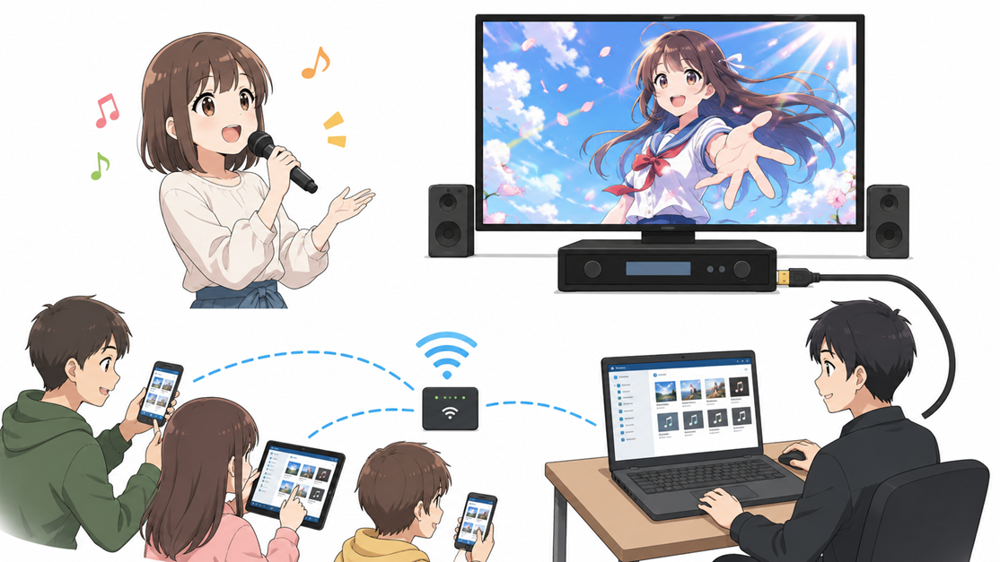
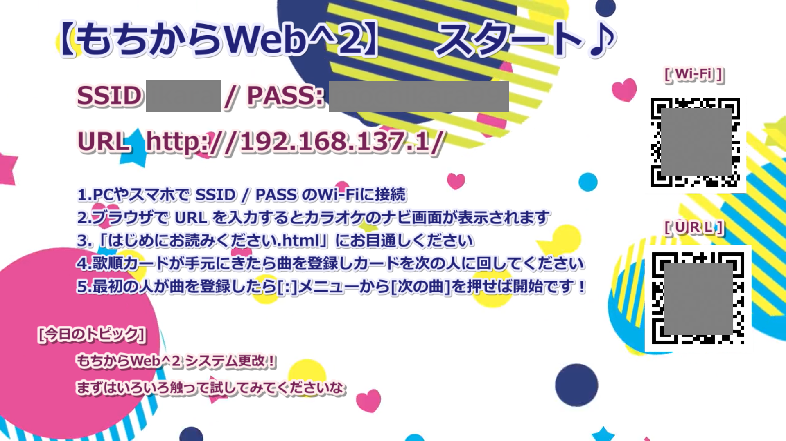
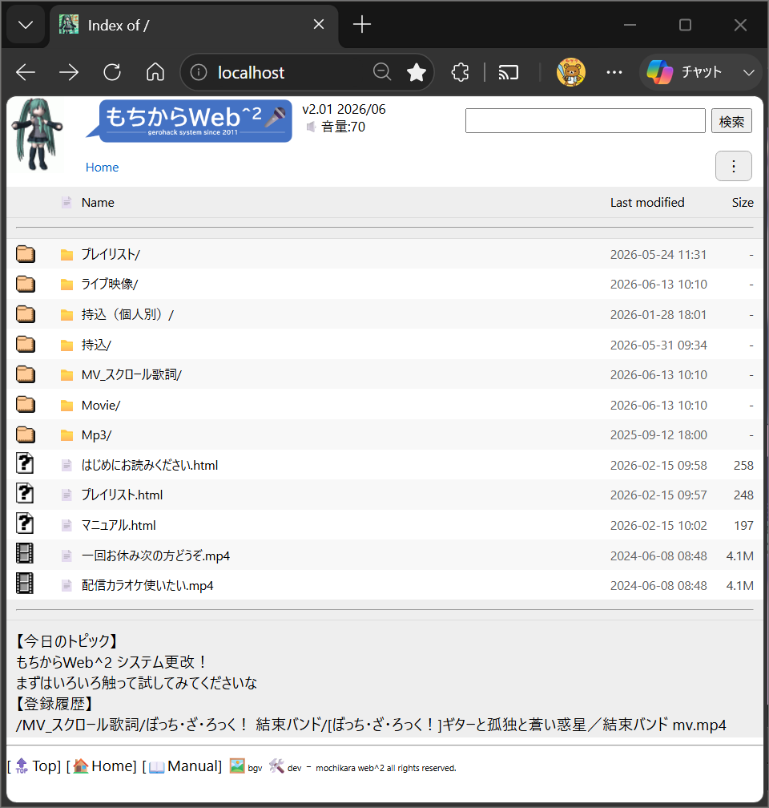
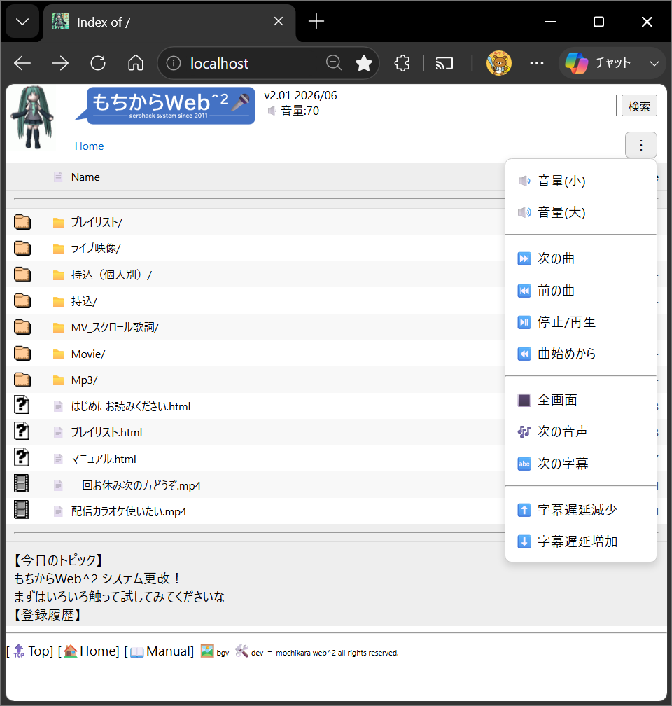
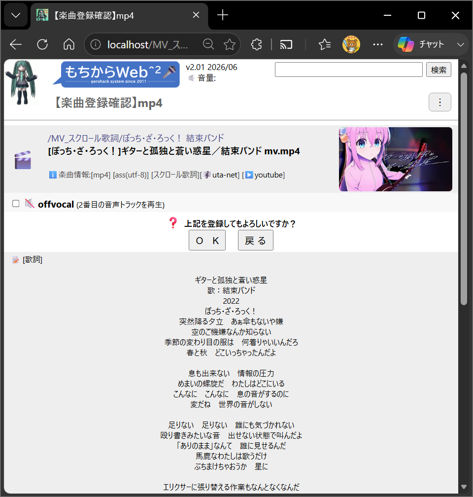
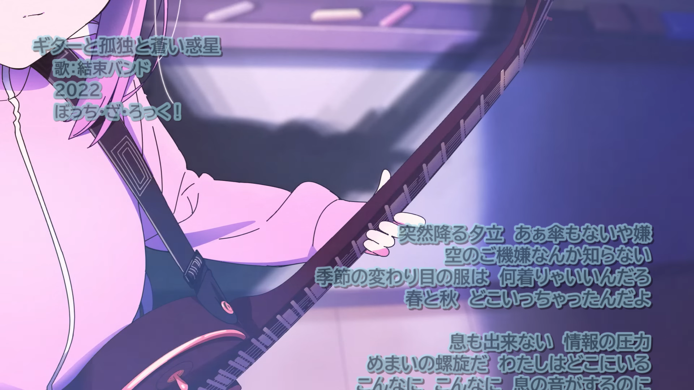
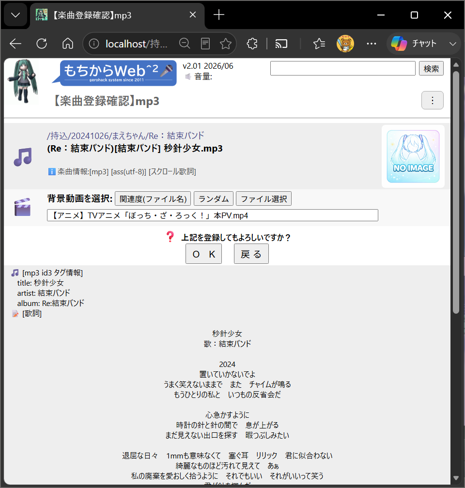
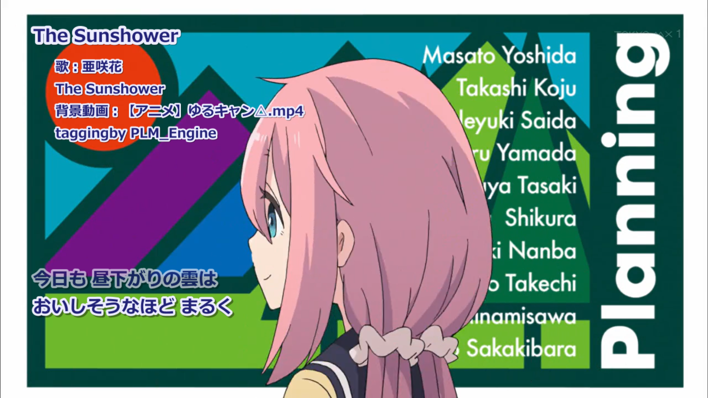

# もちからWeb2 マニュアル（参加者編）

## 1.これっていったい何なの？
**端末から各種動画ファイルと音楽(mp3)ファイルの登録・再生ができるカラオケシステムです**

*図-01.もちからWeb2 システム運営イメージ*

カラオケ店の配信装置にPCを接続し、持ち込んだ動画や音楽ファイルを再生してカラオケを楽しむ「持ち込みカラオケ」を、シームレスかつ円滑に運営するための Web ベースシステムです。
受付用端末は、再生用ノートPCに無線LAN(モバイルホットスポット)で接続できるスマートフォン・PC・タブレット等、ご自分の機器が使用できます。
参加者各自がお使いの機器のブラウザで動画や曲の検索をし登録をすると、順番に再生されます。
特に音楽（mp3）を登録した場合、あわせて好きな背景動画を選択すると、動画と音楽をあわせて再生します。

#### まずはカラオケのディスプレイに表示された無線LAN、URLに接続してください

*図-02.もちからWeb2 スタート動画*

運営PCでは [apache2](https://httpd.apache.org/) と [MPC-BE](https://sourceforge.net/projects/mpcbe/) が起動されて、これをカラオケ店のディスプレイに表示しています。
運営の開始時に、カラオケのディスプレイに接続先の無線LANの名前、パスワードとURLが表示されます。
手順にしたがって接続、操作してください。
無線LAN接続、URLはQRコードを読み取ることで接続することもできます。
接続の仕方が不明な場合、運営にお尋ねください。

---

## 2.どう使うの？
**ブラウザに「もちからWeb」が表示されたら、曲を検索、登録します**

  
  
<em>図-03. もちからWeb2 web画面</em>

エクスプローラ風の画面で、歌いたい楽曲の動画ファイル(mp4,mpg...etc)や音声ファイル(mp3)を選択すると、楽曲登録画面に遷移します。

1. **ミク踊り**
初音ミクさんっぽいアイコンがずっと踊っています。クリックするとホーム画面に戻ります。
2. **検索**
楽曲のファイル名を文字列検索ができます。スペース区切りのand検索です。mp3よりも動画を検索上位に表示し、最大表示件数は1000件です。初回検索時は検索キャッシュを作成しますので少々お待ちください。
3. **ナビゲーション**
現在のフォルダパスをここに表示します。親フォルダに遷移したい場合はクリックしてください。
4. **[⋮] メニュー**
再生中の楽曲に対する操作ができます。次項で説明します。
5. **フォルダ、ファイル一覧**
表示しているフォルダのフォルダとファイルを表示します。ここから楽曲を選択してください。
6. **プレイリスト**
作品やアーティストをもとにしたサムネイル付き一覧です。
新譜情報や過去回の登録楽曲一覧、全曲リスト、uta-netで公開されている楽曲一覧や、youtubeで公開されているプレイリストがあります。
7. **今日のトピック**
運営からの一言。「もちからWeb2 スタート動画」の下部にも表示されます。
8. **登録履歴**
本日、登録された楽曲がフルパスで出力されます。誰が何を登録したかの確認にどうぞ。
9. **フッタメニュー**
最下段のナビゲーションメニューです。
  - 🔝Top 表示画面の最上部に戻ります。
  - 🏠Home ホーム画面(ルートフォルダ)に遷移します。
  - 📖manual このドキュメントを表示します。
  - 🖼️bgv 背景動画一覧です。どんな背景動画があるかを確認したいときに。
  - 🛠️dev 開発者メニュー、カラオケ参加者はクリック不要です。

#### [⋮] メニュー 🆕

  
  
<em>図-04. もちからWeb2 [⋮] メニュー</em>

画面右上にある [⋮] メニュー(ケバブメニュー、というらしい…)では、再生中の楽曲に対しての各種操作ができます。他の人の歌唱中には操作しないようにしてください。
1. 🔉 音量(小) / 🔊 音量(大)
音量を下げます / 上げます 初期値は70で、5刻みで下げ上げします。
これが操作するのは MPC-BE のボリュームであり、PCのマスタボリュームは変更しません。
2. ⏭️ 次の曲 / ⏮️ 前の曲 / ⏯️ 停止/再生 / ⏪ 曲始めから
曲の再生コントロール。
3. 🔳 全画面
MPC-BE の画面を全画面に表示したり、ウィンドウ表示にしたりします。
4. 🎶 次の音声
複数音声が入っている動画の場合、その音声を切り替えます。
特に、offvocal入りの音声はここでボーカルのあり/なしを切り替えられます。
5. 🔤 次の字幕
複数の字幕がある場合、ここで字幕を切り替えられます。
6. ⬆️ 字幕遅延減少 / ⬇️ 字幕遅延増加
字幕の表示タイミングを早めます / 遅らせます。
特にスクロール歌詞では歌詞の表示位置を上げたり下げたりする効果があります。

---
## 3.楽曲を登録するには？
**動画を選択すると楽曲登録確認画面が表示されます**

  
  
<em>図-05. もちからWeb2 【楽曲登録確認】mp4</em>

動画に関する各種情報やサムネイル、歌詞がテキスト情報の場合はその内容を表示します。
問題なければ **[ＯＫ]** のボタンを押してください。
**[戻る]** のボタンを押した場合、前のページに戻ります。

1. ℹ️**楽曲情報**
楽曲に関する以下のような各種情報が表示されます。
- 拡張子 mp4など
- 字幕情報 assファイル(文字コード情報),txtファイル(タイムタグテキスト)
- スクロール歌詞かどうか
- uta-netへのリンク、youtubeへのリンク(スクロール歌詞の場合)

2. **楽曲のサムネイル**
以下のいずれかの動画の画像イメージが表示されます。
- 動画開始後30秒後の画面キャプチャ
- youtubeのサムネイル(スクロール歌詞の場合)

3. 🔇**offvocal チェックボックス**
複数の音声トラックがある場合、このチェックボックスをonにすることで２番目のトラックを登録できます。
（当システムでは２番目の音声トラックがオフボーカルであることを想定しています）
もしも複数の音声トラックがない場合、この項は表示されません。
また、このチェックボックスをつけてなくても、再生中に [⋮] メニュー の 🎶 次の音声 から切り替えることができます。

4. **[歌詞]**
字幕ファイル(ass)、タイムタグテキストファイル(txt)がある場合、この歌詞テキストを表示します。
ルビや曲情報も書き起こしてしまいますので、あくまでも目安としてください。
また、テキスト情報のない楽曲（字幕埋め込み（ハードサブ）の動画）などは表示できませんのでご承知おきください。

5. **ＯＫ / 戻る**
ＯＫを押すと、各種変換などをを実施し、楽曲を登録します。

**インターミッション**
楽曲が再生される前に、30秒のインターミッションが挿入されます。
１曲毎に挿入されますので、このタイミングに雑談等をお願いします。
次の曲に移りたい場合、[⋮] メニューから ⏭️ 次の曲 を選択してください。

**動画の再生**

*図-06.スクロール動画 表示画面(例)*

順番に楽曲の動画と歌詞が表示されます。(上記はスクロール歌詞の表示例です)
登録順序の変更や、誤登録の削除などは、運営者にお声がけください。

当然ですが、歌詞情報がなく、埋め込み歌詞(ハードサブ)でもない動画を再生しても字幕は表示されません。
発見の際には運営に一声おかけください。

#### 音声(mp3)を選択すると、合わせて再生する映像ファイルを選択できます

  
  
<em>図-06. もちからWeb2 web画面</em>

再生するのが音声ファイル(mp3)の場合、合わせて表示する映像（このシステムでは背景動画と呼称しています）を選択することができます。
音声ファイルに合いそうな映像を適当に選んでください。

1. **関連度(ファイル名)**
初期表示される背景動画。ファイル名をベースに関連度の高い背景動画が選択されます。
ただし、同じ文字をつかっているかどうかだけなので、関連度が低い動画が選択される可能性があります。
2. **ランダム**
背景動画の一覧からランダムで選択します。気に入ったのが表示されるまで繰り返し押してください。
3. **ファイル選択**
背景動画の一覧が表示されます(100以上)ので、好きなファイルを選択してください。
任意の背景動画を探したい場合、ブラウザの検索機能(CTRL+F など)を使ってください。

なお、背景動画はフッタメニューの 🖼️bgv から確認することができます。

楽曲情報などは動画と同様に表示がされますが、以下は表示されませんのでご承知おきください。
- 楽曲のサムネイル  : 動画情報がありませんので表示されません。
- offvocal チェックボックス : 複数トラックがありませんので表示されません。

音声(mp3)の場合も、動画と同様にインターミッションが挿入されます。

**音声(mp3)の再生**

*図-06.タイムタグテキスト＋背景動画 表示画面(例)*

背景動画と合わせて音声(mp3)を再生します。
上記は、タイムタグテキスト形式(txt)とmp3の組み合わせのものです。
以前、Winampなどで運営されていた時の形式も、そのまま再生することができます。
また、assのスクロール歌詞にも対応しています。

当然ですが、歌詞情報のないmp3を再生しても字幕は表示されません。
発見の際には運営に一声おかけください。

### 基本的な使いかたは以上です。

---
## 4. どんなところが良いの？

以降は、このもちからWeb2システムの特徴となるところを記載しています。
(一部は mixi発祥のコミュニティ【唄うことに幸せを感じる人】（略称うたさち）のコミュニティ専用の機能になります)

### 4.1 リアルタイムタイムタグテキスト変換 ＋ 背景動画

Winampでもちこみカラオケをしていた時代の遺産(レガシー)をそのまま引き継いでおり、リアルタイムでタイムタグテキスト(txt)ファイルを字幕ファイル(ass)に変換、背景動画と重ね合わせて表示することができます。
mp3のID3タグから取得したタイトルやアーティストの情報、またはタイムタグテキスト形式の @タグ情報をもとに、歌いだしの右上部に楽曲の情報を表示します。
また、Winamp時間 にも対応しており、@TimeRatio タグを解釈します。

従来はリモートバッチ処理方式だったのが、もちからWeb2でリアルタイム処理になりました。🆕

### 4.2 プチリリ連携 

*プチリリ は、株式会社シンクパワーが運営する 歌詞の検索投稿コミュニティサイトです。*

もちからWeb2では、プチリリのサイトで取り扱うタイムタグを利用することができます。
`/Mp3/` フォルダ配下の多くは、この形式で作成されたタイムタグ付 mp3 ファイルを格納しています。
このフォルダ配下の曲は、すべて行タグ（カラオケのような文字毎のワイプがない形式）になります。

以前はプチリリのPC用ツールを用いて表示する機能もありましたが、該当ツールの廃止にあわせて機能の廃止がされています。

### 4.3 スクロール歌詞

*uta-net(歌ネット)は、株式会社PAGE ONEが運営する 2001年開設、国内最大級の歌詞検索サービスです。*

もちからWeb2では、uta-net の歌詞情報をもとに、歌詞が下から上にスクロールしていくタイプの字幕ファイル(ass)に対応しています。このスクロール歌詞のassには、タイトルや作詞作曲、リリース年などの曲情報が格納されていますので、この情報をもとに後述のプレイリストが作成されます。
また、プレイリスト機能に連携して新しい楽曲が追加されていきますので、最新のアニメタイアップ曲などをすぐに歌うことができます。

スクロール歌詞は発声タイミングが調整されていないことがありますので、歌詞が画面上部または画面下部に見切れてしまう場合は ⬆️ 字幕遅延減少 / ⬇️ 字幕遅延増加 を使って調整してください。

スクロール歌詞用動画には、以下のような種類があります。厳密なものではありませんが、楽曲選択の際の目安としてください。

<b>表-01.スクロール歌詞用動画の分類</b>

| 分類 | 説明 |
|------|------|
| mv | MusicVideoなど、一般的なスクロール歌詞動画の分類。動画を編集せずそのまま使用しています。 アーティストが提供しているMusicVideoである場合が多いです。|
| youtube | youtube上で取得可能な、音声と映像を合成したスクロール歌詞動画の分類。例えばフルのオーディオに、アニメのノンクレジットオープニング動画(ショート)の映像をループ編集したもの、などが多いです|
| THE FIRST TAKE | 2019年11月に開設されたYouTubeチャンネルで、一発撮りのパフォーマンスを高画質・高音質で収録することをコンセプトとしています。この動画にあわせて歌うことができます。|
| LyricVideo | 歌詞が映像に埋め込まれたいわゆるリリックビデオ。スクロール歌詞で歌ってください。|
| Live | ライブ映像。歌詞タイミングが合わないことが多いので注意のほどを。|
| LiveBGV | ライブ映像ですが、フル尺がない場合、これを背景動画のようにしてループ編集したものが多いです。映像と発声タイミングが合っていませんが、気にしないでください。|

### 4.4 プレイリスト

*youtube / youtube music は、アメリカ合衆国 カリフォルニア州 サンブルーノ に本社を置くオンライン 動画共有プラットフォームです*

youtubeで公開されている プレイリストの曲一覧をもとに、楽曲のグループをサムネイル付きで一覧化したものです。
**履歴などの機能もプレイリストに統合しました**
プレイリストについては一覧ページに説明がありますのでそちらを参照ください。

このプレイリストを作成する機能自体ももちからWeb2にございます。
これは開発者用の機能ですが、特定の楽曲が欲しい、といった要望がありましたら遠慮なく開発者までお伝えください。

また、プレイリスト作成時、または楽曲の情報表示時にサムネイルを作成する機能が追加されました。🆕
スクロール歌詞でサムネイル情報があるときにはそのURLを使用します。
ない場合には、ffmpegで動画の開始30秒後の画像を使用します。これは動画(mp4)のみの機能です。

### 4.5  オフボーカル 🆕
オープンソースの音源分離ツール **Demucs（デモックス）** を用いて、ボーカルとその他の音源を分離し、mp4 の音声多重化で2番目のトラックにオフボーカル音声を同梱しました。
Demucs は Meta 社が AI 技術を利用して作った非常に高性能の音源分離ツールであり、GPU を用いて解析を行います。
リアルタイムでの処理は難しいため、
* `/MV_スクロール歌詞/`
* `/持込/`
配下のすべての mp4 を対象として一括バッチ処理しています。
（メインPCの GeForce RTX 3060 が Diablo Immotal 以外で役に立つとは…）

なお、ファイル名と拡張子の間に余分なスペースがある場合、Demucsがsystem errorを出力するようなので、持込の際には気にしていただけると幸いです。

### 4.6 MochiutaSC 🆕

スクロール歌詞を簡単に作成するためのPC用ツールです。autohotkey で作成されています。
動画とuta-netのIDを用意するだけで簡単に作成できます。
詳細については別リポジトリになっていますので、以下を参照してください。
https://github.com/utasachi/MochiutaSC#readme

### 4.7 GitHub ＆ ローカルプレイリスト 🆕

もちからWeb2関係の資材をすべてGithubで管理するようにしました。
プレイリストも Github Pagesで公開していますので、どんな曲が格納されているかを事前に確認できます。

| リポジトリ | URL |
|------|------|
|GitHub utasachi 全体|https://github.com/utasachi|
|utasachi - bin (更新履歴)|https://github.com/utasachi/bin#readme|

---
## 5. 持込はどのようにするの？

楽曲の持込は大歓迎です。USBメモリやHDDで持込ください。
ただし、現状はリアルタイムに歌詞付けはできません。

### 以降鋭意執筆中
